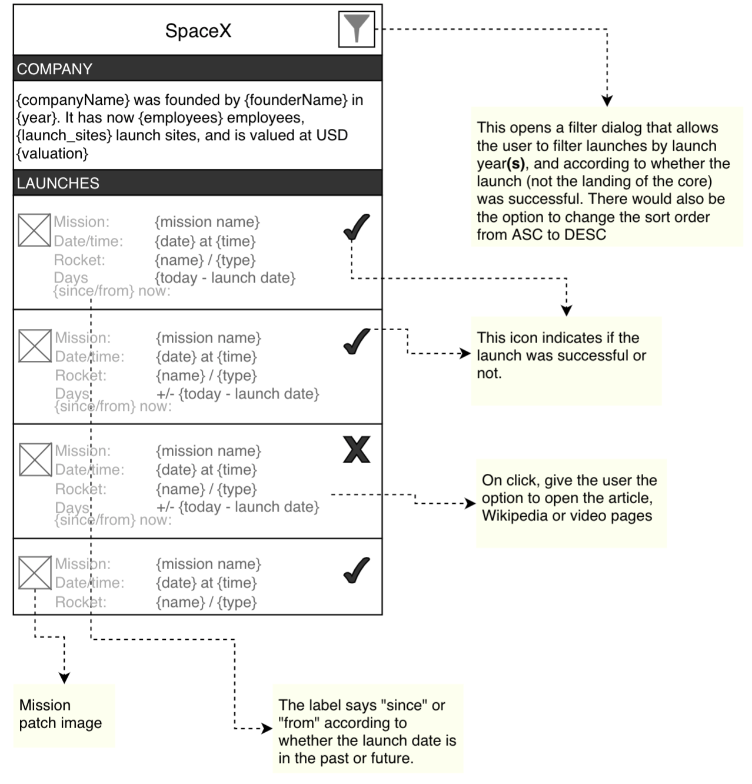

# SpaceX Rocket Science

## Task Description

### Requirements

Use the SpaceX API documented here: https://documenter.getpostman.com/view/2025350/RWaEzAiG?version=latest

**API Endpoints:**
- **Company Info** (`GET /v3/info`) - returns the data for the section at the top of the screen
- **All launches** (`GET /v3/launches`) - returns the data for the rest of the list

### Build Target

## Architecture

This Android application follows **Clean Architecture** principles with a layered approach:

### Layers

- **Presentation Layer** - Jetpack Compose UI with MVVM pattern
- **Domain Layer** - Use cases and business logic with domain models
- **Data Layer** - Repository pattern with local and remote data sources

### Technologies Used

- **UI Framework**: Jetpack Compose
- **Architecture**: MVVM + Clean Architecture
- **Dependency Injection**: Dagger Hilt
- **Local Storage**: Room Database with SQLite
- **Networking**: Retrofit + OkHttp
- **Reactive Programming**: Kotlin Coroutines + Flow
- **Testing**: JUnit, MockK, Truth
- **Build System**: Gradle with Kotlin DSL

### Key Features

- **Offline-first approach** with local caching
- **Real-time data synchronization** using Flow
- **Comprehensive error handling** for network failures
- **Stale data preservation** during offline scenarios
- **1-week cache duration** for company information
- **Filtering capabilities** by launch year and status

## Author

Built with ❤️ by Daniel Bejan using Android development best practices

